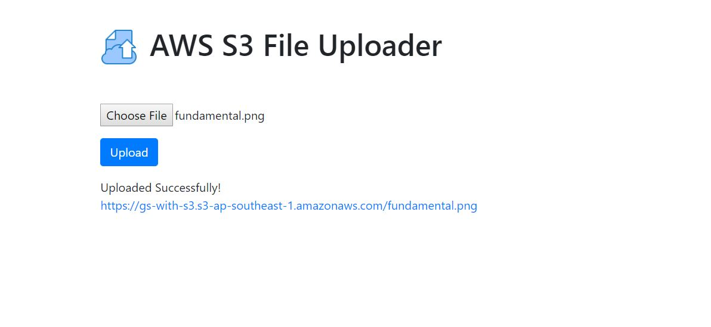

# AWS S3 Uploader

## Screenshot

## Description

A simple file uploader to AWS S3 using presigned POST URL.

## Run the project

Config S3 in environment variables then use the command `npm start`.
